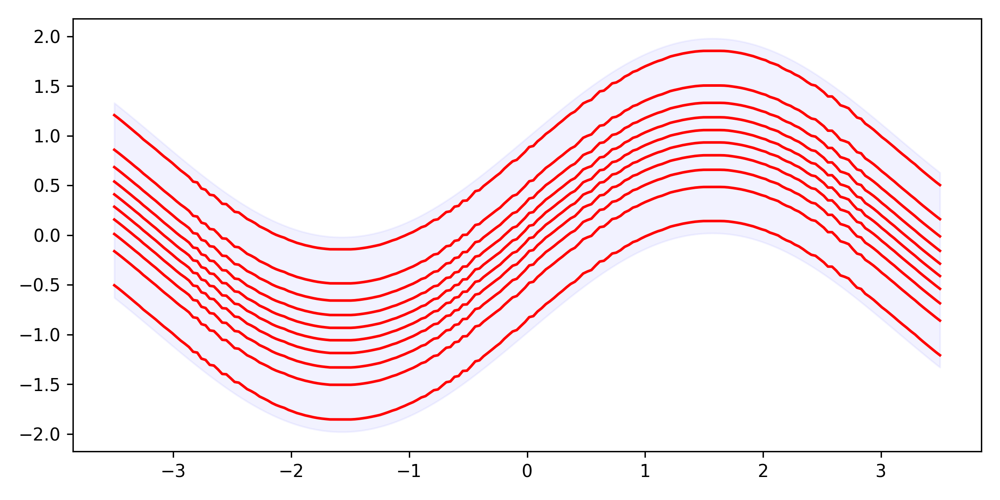

# Wasserstein Gradient Boosting: A General Framework with Applications to Posterior Regression


## About

Wasserstein Gradient Boosting (WGBoost) is a novel family of gradient boosting that returns a set of particles that approximate a target distribution assigned at each input-data point.
In probabilistic forecasts, a parametric output-distribution is often specified on the space of output variables and a machine learning model returns a point estimate of the output-distribution parameter for each input.
A main application of WGBoost in this work is a novel distributional estimate of the output-distribution parameter, which approximates the posterior distribution over the output-distribution determined pointwise at each data point.
The probabilitic forecast by WGBoost delivers enhanced predictive accuracy and demonstrates usefulness for out-of-distribution detection.
This repository contains sources codes for the following paper:

> Takuo Matsubara. Wasserstein Gradient Boosting: A General Framework with Applications to Posterior Regression. *arxiv*, 2024.

The files in this repository reproduce the experiments presented in the paper. Examples to run each code can be found in the 'script/' folder.


## Prerequisite

The source code uses Python (version 3.11.7) and the following Python libralies:

- torch (version 2.2.1)
- numpy (version 1.26.4)
- scikit-learn (version 1.4.1.post1)
- scipy (version 1.11.4)
- joblib (version 1.2.0)
- pandas (version 2.1.4)
- matplotlib (version 3.8.0)
- seaborn (version 0.12.2)
- xlrd (version 2.0.1)


## Example Usage

The following is an example usage of our default algorithm SKA-WGBoost (shortly SWGBoost for the class name).
We place the 'src/swgboost.py' file in the same directory as the example code or add a path to the file.

```python
import numpy as np, scipy, torch
import matplotlib.pyplot as plt, seaborn as sns
from sklearn.tree import DecisionTreeRegressor
from swgboost import SWGBoost

X = np.linspace(-3.5, 3.5, 200).reshape(-1,1)                   # input data
Y = np.sin(X)                                                   
D = scipy.stats.norm(loc=Y.flatten(), scale=0.5)                # target distributions N( p | m=y_i, s=0.5 ) conditional on each y_i in Y = sin(X)

grad_logp = lambda p, y: - (p - y) / 0.5**2                     # define the log gradient of the target distribution N( p | m=y, s=0.5 ) at a location p conditional on a value y
hess_logp = lambda p, y: - torch.ones(1) / 0.5**2               # define the log hessian diagonal of the target distribution N( p | m=y, s=0.5 ) at a location p conditional on a value y
reg = SWGBoost(grad_logp, hess_logp, DecisionTreeRegressor,     # use DecisionTreeRegressor as each base learner 
    learner_param = {'max_depth': 3, 'random_state': 1},        # pass hyperparameters to DecisionTreeRegressor
    learning_rate = 0.1,                                        # set the learning rate
    n_estimators = 100,                                         # set the number of base learners to be used
    n_particles = 10,                                           # set the number of output particles of SWGBoost
    d_particles = 1,                                            # inform the dimension of each output particle of SWGBoost
    init_iter = 0,                                              # no optimisation for the initial state of SWGBoost
    init_locs = np.linspace(-10, 10, 10).reshape(-1, 1))        # set the initial state of SWGBoost
reg.fit(X, Y)                                                   # fit SWGBoost
P = reg.predict(X)                                              # predict by SWGBoost

fig, ax = plt.subplots(figsize=(8,4))                           # plot the output
ax.fill_between(X.flatten(), D.ppf(0.025), D.ppf(0.975), color='b', alpha=0.05)
[ sns.lineplot(x=X.flatten(), y=P[:,ith].flatten(), color="red", ax=ax) for ith in range(reg.n_particles) ]
fig.tight_layout()
```



The parameters of the SWGBoost class are given as follows:

```
Parameters of SWGBoost
----------
grad_logp : function of two PyTorch tensor arguments (p, y)
    a function to return the gradient vector of a target distribution at \theta conditional at each output datum y.
    the first argument is a particle location p and the second argument is an output datum y.

hess_logp : function of two PyTorch tensor arguments (p, y)
    a function to return the hessian diagonal vector of a target distribution at \theta conditional at each output datum y.
    the first argument is a particle location p and the second argument is an output datum y.

learner_class : any class that has 'fit' and 'predict' attributes
    a class of a learning algorithm used for each base learner.

learner_param : dict, default=None
    a parameter disctionary to be passed to the learning algorithm class.

learning_rate : float, default=0.1
    a learning rate to ensemble each base learner.

n_estimators : int, default=500
    the number of base learners to be used in total.

n_particles : int, default=10
    the number of output particles. 

d_particles : int, default=1
    the dimension of each output particle.

bandwidth : float, default=0.1
    a scale hyperparameter of the Gaussian kernel used for the smoothed Wasserstein gradient and Hessian.

random_state : int, default=0
    a random seed for any random sampling used in WGBoost (used for sampling starting points for optimisation of the initial state of WGBoost if not specified).

init_iter : int, default=5000
    the number of iteration for optimisation of the initial state of WGBoost.

init_lr : float, default=0.1
    a learning rate for optimisation of the initial state of WGBoost.

init_locs : np.ndarray, default=None
    starting points for optimisation of the initial state of WGBoost.
```


## Dataset

The experiments in the paper use nine UCI datasets for regression and two UCI datasets for classification from https://archive.ics.uci.edu/.
Some of the datasets are remotely loaded from a UCI public server and the rest are directly loaded from the files placed under the directory "data/uci/".
The processed files of the *segment* and *sensorless* datasets were downloaded from https://github.com/sharpenb/Posterior-Network.
Additionally, the experiments use the *bone mineral density* dataset in "The Elements of Statistical Learning (Springer New York, 2009) by Trevor Hastie, Robert Tibshirani, and Jerome Friedman" and the *old faithful geyser* dataset in "Applied Linear Regression (John Wiley & Sons, 1985) by Sanford Weisberg", each of which are located under the directory "data/cde/".
The former can be downloaded from https://hastie.su.domains/ElemStatLearn/.
The latter can be downloaded from https://www.stat.cmu.edu/~larry/all-of-statistics/.


## License

The source codes is licensed under the MIT License (see LICENSE file).


